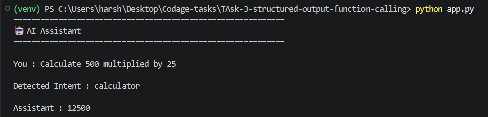
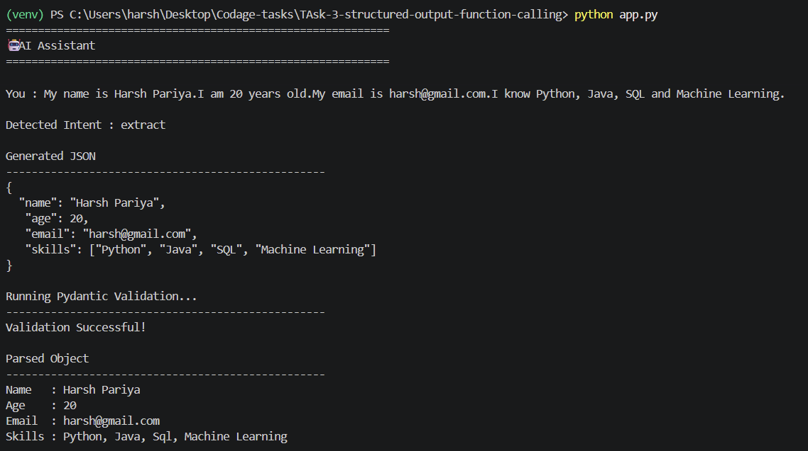
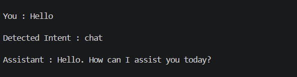

# 🤖 AI Function Calling Chatbot

An intelligent AI chatbot built with **Python**, **Groq API**, and **Pydantic** that demonstrates **Native Function Calling**, **Intent Detection**, **Structured Output**, and **Custom Data Validation**.

This project was developed as part of an AI Engineering internship assignment to showcase how Large Language Models (LLMs) can intelligently choose Python tools, extract structured information, and validate AI-generated outputs before using them.

---

# 🚀 Features

- ✅ Native Function Calling using Groq API
- ✅ Automatic Intent Detection
- ✅ Calculator Tool
- ✅ Current Time Tool
- ✅ Structured JSON Extraction
- ✅ Custom Pydantic Validation
- ✅ Interactive Command-Line Chatbot
- ✅ Detailed Validation Error Reporting

---

# 🛠️ Tech Stack

| Technology | Purpose |
|------------|---------|
| Python | Programming Language |
| Groq API | LLM & Native Function Calling |
| Llama 3.3 70B | Language Model |
| Pydantic v2 | Schema Validation |
| python-dotenv | Environment Variables |
| Email Validator | Email Validation |

---

# 📂 Project Structure

```text
structured-output-function-calling/
│
├── app.py
├── tools.py
├── schemas.py
├── requirements.txt
├── README.md
├── .env
├── .gitignore
└── examples/
    ├── calculator.png
    ├── time.png
    ├── structured_output.png
    └── chat.png
```

---

# 🧠 Application Workflow

```text
                     User
                       │
                       ▼
             Intent Detection (LLM)
                       │
      ┌────────────────┼─────────────────┐
      ▼                ▼                 ▼
 Calculator        Current Time     Information
      │                │            Extraction
      ▼                ▼                 │
 Python Tool      Python Tool            ▼
                                  Structured JSON
                                          │
                                          ▼
                              Pydantic Validation
                                          │
                                          ▼
                                  Final Response
```

The chatbot first determines the user's intent and then automatically routes the request to the appropriate workflow.

---

# ⚙️ Tool 1 — Calculator

Performs mathematical calculations using a native Python function.

### Supported Operations

- Addition
- Subtraction
- Multiplication
- Division

### Example

**Input**

```text
Calculate 500 multiplied by 25
```

**Output**

```text
Detected Intent : calculator

Assistant : 12500
```

---

# 🕒 Tool 2 — Current Time

Returns the current local system time.

### Example

**Input**

```text
What is the current time?
```

**Output**

```text
Detected Intent : time

Assistant : 02:15 PM
```

---

# 📄 Structured Output

The chatbot automatically extracts structured information from natural language.

### Input

```text
My name is Harsh Pariya.
I am 20 years old.
My email is harsh@gmail.com.
I know Python, Java, SQL and Machine Learning.
```

### Generated JSON

```json
{
  "name": "Harsh Pariya",
  "age": 20,
  "email": "harsh@gmail.com",
  "skills": [
    "Python",
    "Java",
    "SQL",
    "Machine Learning"
  ]
}
```

---

# ✅ Custom Pydantic Validation

The generated JSON is validated before it is used.

The project includes custom validation rules for:

### Name Validation

- Minimum length
- Maximum length
- Removes extra spaces
- Allows only alphabets and spaces
- Automatically converts to Title Case

### Age Validation

- Age must be between **1** and **100**

### Email Validation

- Valid email format
- Converts email to lowercase
- Blocks temporary/fake domains

Example blocked domains:

- spam.com
- fake.com
- tempmail.com

### Skills Validation

- Removes extra spaces
- Rejects very short skill names
- Converts every skill to Title Case

---

# 🚨 Validation Error Example

Example Input

```text
My name is Harsh Pariya.
I am 250 years old.
My email is harsh@spam.com.
I know AI.
```

Output

```text
Validation Failed!

Field : age
Error : Input should be less than or equal to 120

Field : email
Error : Temporary or blocked email domains are not allowed.
```

---

# 🎯 Intent Detection

Instead of requiring special commands like:

```text
extract:
```

the chatbot automatically determines the user's intent.

### Calculator

```text
Calculate 20 × 30
```

↓

Calculator Tool

---

### Time

```text
What is the current time?
```

↓

Time Tool

---

### Information Extraction

```text
My name is Harsh...
```

↓

Structured JSON + Validation

---

### Normal Conversation

```text
Hello
```

↓

Normal Conversation

---


# 💬 Example Conversation

### Calculator

```text
You : Calculate 250 multiplied by 40

Detected Intent : calculator

Assistant : 10000
```

---

### Time

```text
You : What is the current time?

Detected Intent : time

Assistant : 02:20 PM
```

---

### Structured Output

```text
You :

My name is Harsh Pariya.
I am 20 years old.
My email is harsh@gmail.com.
I know Python, Java, SQL and Machine Learning.
```

Output

```text
Detected Intent : extract

Generated JSON

Validation Successful!

Parsed Object

Name   : Harsh Pariya
Age    : 20
Email  : harsh@gmail.com
Skills : Python, Java, SQL, Machine Learning
```

---

### Chat

```text
You : Who are you?

Detected Intent : chat

Assistant :

I am an AI Assistant built using Python and the Groq API.
```

---

# 📸 Screenshots

## Calculator



---

## Current Time


---

## Structured Output



---

## Validation Error


---

## Chat



---

# 📌 Assignment Requirements Covered

- ✅ Native Function Calling
- ✅ Two Callable Python Tools
- ✅ Tool JSON Schemas
- ✅ Structured JSON Output
- ✅ Pydantic Schema Validation
- ✅ Custom Field Validators
- ✅ Interactive Chatbot
- ✅ Automatic Intent Detection
- ✅ Validation Error Reporting

---

# 🚀 Future Improvements

- Weather API Integration
- Currency Converter Tool
- PDF Information Extraction
- Retrieval-Augmented Generation (RAG)
- Streamlit Web Interface
- Voice Assistant
- Docker Support
- Unit Testing
- Logging & Monitoring

---

